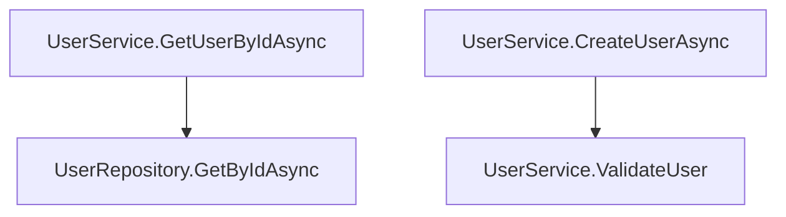

# Static Code Analyzer - Phase 1: Code Graph Extraction

A comprehensive C# CLI tool (built with .NET 8 and Roslyn) that performs **static code analysis** to extract and visualize:
- **Call Graph** - Function invocation relationships
- **Data Flow Graph** - Variable/object lifecycle tracking

## ?? Purpose

This tool is designed for scientific research to extract **Business Workflow Flows** from source code. Phase 1 focuses on building a foundational **Code Graph** by analyzing C# repositories using Abstract Syntax Trees (AST).

## ?? Features

### 1. **Call Graph Extraction**
- Analyzes method invocations across the codebase
- Captures: `CallerClass.Method` ? `CalleeClass.Method`
- Tracks location (file path and line number)
- Filters out standard library calls (System.*, etc.)

### 2. **Data Flow Graph Extraction**
- Tracks variable/object lifecycle from source to sink
- Identifies:
  - **Source**: Where variables are declared or passed as parameters
  - **Passed Through**: Methods that receive the variable as parameter
  - **Sink**: Where variables are returned or stored

### 3. **Multiple Output Formats**
- **JSON** (`output_graph.json`) - Raw data structure for further processing
- **Markdown Diagrams** - Visual representations
  - `call_graph.md` - Method invocation flow
  - `data_flow_graph.md` - Data transformation journey
- **HTML Visualizations** (NEW!) - Interactive diagrams
  - `output_graph.html` - Combined tabbed view (supports up to 5000 edges!)
  - `call_graph.html` - Standalone call graph
  - `data_flow_graph.html` - Standalone data flow graph

## ?? Usage

```bash
Repo_Into_Graph <repository-path> [output-directory]
```

### Arguments
- `<repository-path>`: Path to directory containing C# source code
- `[output-directory]` (optional): Output directory (default: `./output`)

### Example
```bash
# Analyze a local project
Repo_Into_Graph "C:\MyProject" ".\analysis_output"

# Use default output directory
Repo_Into_Graph "C:\MyProject"
```

## ?? Output Files

### 1. `output_graph.json`
Complete analysis data containing:
```json
{
  "CallGraph": [
    {
      "CallerClass": "UserService",
      "CallerMethod": "CreateUserAsync",
      "CalleeClass": "UserRepository",
      "CalleeMethod": "SaveAsync",
      "FilePath": "...",
      "LineNumber": 25
    }
  ],
  "DataFlowGraph": [
    {
      "VariableName": "user",
      "DataType": "User",
      "SourceLocation": "UserService.CreateUserAsync",
      "PassedThroughMethods": ["UserService.ValidateUser", "UserRepository.SaveAsync"],
      "SinkLocation": "UserService.CreateUserAsync",
      "SinkType": "return"
    }
  ],
  "MermaidCallGraph": "...",
  "MermaidDataFlowGraph": "..."
}
```

### 2. `call_graph.md`
Mermaid diagram showing method call relationships:


### 3. `data_flow_graph.md`
Mermaid diagram showing variable lifecycle:
```mermaid
graph LR
    source_UserService_CreateUserAsync["?? Source: UserService.CreateUserAsync"]
    source_UserService_CreateUserAsync -->|user (User)| var_user["user"]
    var_user -->|Passed Through| methods_user["Methods: UserService.ValidateUser, UserRepository.SaveAsync"]
    var_user -->|return| sink_UserService_CreateUserAsync["?? Sink: UserService.CreateUserAsync"]
```

### 4. `output_graph.html` (NEW!)
**Interactive tabbed HTML visualization** with full Mermaid.js support:
- ? **Supports up to 5,000 edges** (vs 500 in Markdown)
- ? **Professional tabbed interface** - Switch between Call Graph and Data Flow
- ? **Responsive design** - Works on desktop, tablet, and mobile
- ? **Self-contained** - Single HTML file, no external CSS/JS files needed
- ? **Interactive features** - Zoom, pan, and full-screen support
- ? **Export-friendly** - Save as PDF directly from browser

**How to use:**
```bash
# Open in browser
open output_graph.html  # macOS
start output_graph.html # Windows
xdg-open output_graph.html # Linux
```

### 5. `call_graph.html` & `data_flow_graph.html` (NEW!)
**Standalone HTML files** for individual graphs:
- Full-page focused view
- Optimized layout for large diagrams
- Perfect for sharing or embedding in documentation

---

## ?? Usage

### Core Components

#### 1. **CallGraphExtractor** (`Services/CallGraphExtractor.cs`)
- Uses Roslyn's `CSharpSyntaxWalker` to traverse AST
- Extracts all method invocations
- Filters standard library calls using namespace checking

#### 2. **DataFlowGraphExtractor** (`Services/DataFlowGraphExtractor.cs`)
- Tracks variable declarations and parameter flows
- Monitors method parameter passing
- Records return statements as sinks
- Skips primitive types and System.* types

#### 3. **CodeAnalyzer** (`Services/CodeAnalyzer.cs`)
- Orchestrates the analysis pipeline
- Parses all C# files in the repository
- Creates semantic model for symbol resolution
- Aggregates results from extractors

#### 4. **MermaidGenerator** (`Services/MermaidGenerator.cs`)
- Generates Mermaid.js diagram syntax
- Deduplicates edges
- Sanitizes node names for diagram compatibility

#### 5. **OutputWriter** (`Services/OutputWriter.cs`)
- Serializes results to JSON
- Generates Markdown files with Mermaid diagrams

## ?? Models

### CallGraphEdge
```csharp
public class CallGraphEdge
{
    public required string CallerClass { get; set; }
    public required string CallerMethod { get; set; }
    public required string CalleeClass { get; set; }
    public required string CalleeMethod { get; set; }
    public string FilePath { get; set; }
    public int LineNumber { get; set; }
}
```

### DataFlowNode
```csharp
public class DataFlowNode
{
    public required string VariableName { get; set; }
    public required string DataType { get; set; }
    public string? SourceLocation { get; set; }
    public required List<string> PassedThroughMethods { get; set; }
    public string? SinkLocation { get; set; }
    public string? SinkType { get; set; }
}
```

## ?? Filtering Strategy

### Standard Library Exclusions
The tool automatically filters out:
- System.*
- System.Collections.*
- System.Linq
- System.Text
- System.IO
- System.Threading
- System.Diagnostics
- System.Net
- System.Reflection

**Rationale**: Focus only on user-defined business logic to reduce noise and complexity.

### Primitive Type Exclusions
Skipped in data flow analysis:
- `int`, `string`, `bool`, `double`, `float`, `long`, `short`, `byte`, `decimal`, `char`

**Rationale**: Track only business-critical objects (DTOs, models, entities).

## ?? Input Requirements

The tool expects:
- A directory containing `.cs` files
- Valid C# syntax (files should compile without errors)
- Supports nested directory structures
- Automatically excludes `bin/` and `obj/` directories

## ?? Technical Stack

- **Language**: C# (.NET 8)
- **AST Analysis**: Microsoft.CodeAnalysis.CSharp (Roslyn)
- **Serialization**: System.Text.Json
- **Diagram Format**: Mermaid.js

## ?? Dependencies

```xml
<PackageReference Include="Microsoft.CodeAnalysis.CSharp" Version="4.8.0" />
<PackageReference Include="Microsoft.CodeAnalysis.Analyzers" Version="3.3.4" />
```

## ?? Example: UserService Analysis

### Sample Code
```csharp
public class UserService
{
    private readonly UserRepository _repository;

    public async Task<User> GetUserByIdAsync(int userId)
    {
        var user = await _repository.GetByIdAsync(userId);
        if (user != null)
        {
            LogUserAccess(user);
        }
        return user;
    }

    public async Task<bool> CreateUserAsync(User user)
    {
        ValidateUser(user);
        var result = await _repository.SaveAsync(user);
        if (result)
        {
            NotifyUserCreated(user);
        }
        return result;
    }

    private void ValidateUser(User user) { ... }
    private void LogUserAccess(User user) { ... }
    private void NotifyUserCreated(User user) { ... }
}
```

### Generated Call Graph
```
UserService.GetUserByIdAsync() ? UserRepository.GetByIdAsync()
UserService.CreateUserAsync() ? UserService.ValidateUser()
UserService.CreateUserAsync() ? UserRepository.SaveAsync()
UserService.CreateUserAsync() ? UserService.NotifyUserCreated()
```

### Generated Data Flow for `user` variable
```
Source: UserService.CreateUserAsync (parameter)
  ?
Passed Through: UserService.ValidateUser
  ?
Passed Through: UserRepository.SaveAsync
  ?
Passed Through: UserService.NotifyUserCreated
  ?
Sink: UserService.CreateUserAsync (return via result)
```

## ?? Research Applications

This tool supports:
1. **Business Process Mining** - Extract workflows from legacy code
2. **Data Dependency Analysis** - Understand data transformation pipelines
3. **Code Architecture Analysis** - Visualize system structure
4. **Refactoring Planning** - Identify coupling and dependencies
5. **Documentation Generation** - Auto-generate architecture diagrams

## ?? Future Enhancements (Phase 2)

- Control Flow Graph extraction
- Exception flow tracking
- Inter-module dependency analysis
- Pattern recognition (Service Locator, Factory, etc.)
- Complexity metrics calculation
- Cross-file semantic analysis
- Support for async/await chains

## ?? License

This research tool is provided for academic and research purposes.

## ?? Contributing

For research collaborations or extensions, please refer to the project documentation.

---

**Built with ?? for Research**
