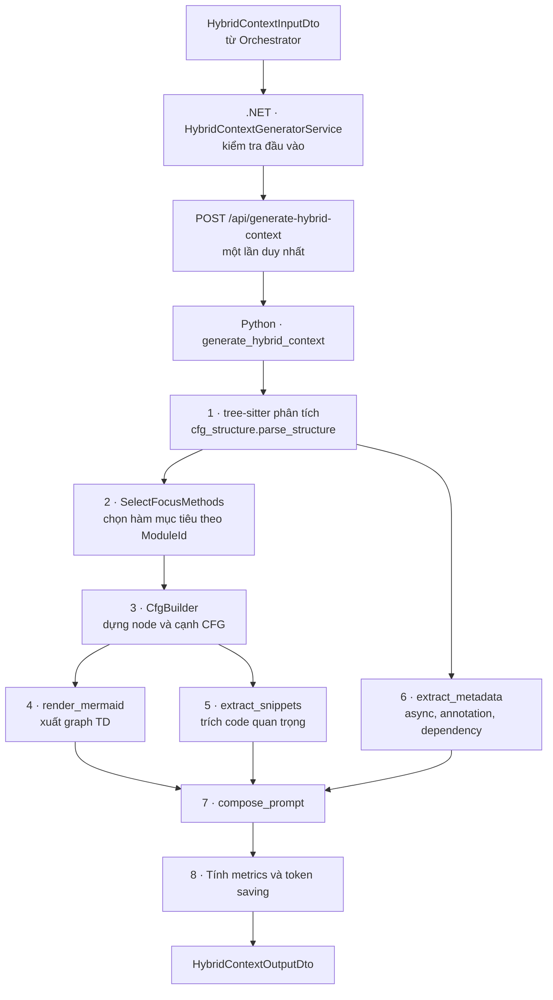
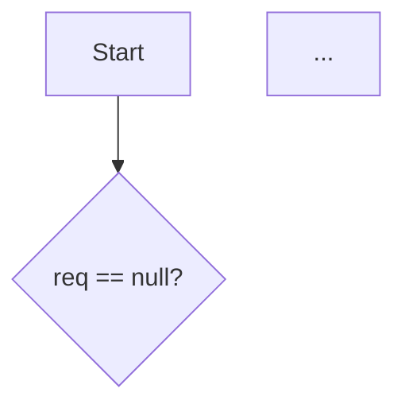

# TẦNG 2 — HYBRID CONTEXT GENERATOR — Tài liệu triển khai

> **Nhánh:** `master` · **Ngôn ngữ:** Python (lõi xử lý) + C# (.NET 8, điều phối) · **Tổng:** ~2.100 dòng
> **Phạm vi:** logic Tầng 1 không bị sửa — `main.py` chỉ được chèn thêm endpoint `/api/generate-hybrid-context` ở cuối file
> **Author:** Slazenger
---

## 1. Tầng 2 làm gì

Nhận một đoạn mã nguồn đã được Tầng 1 định tuyến sang `ROUTE_HYBRID`, rồi sinh ra **Ngữ cảnh Lai** — bản nén của mã nguồn gồm 3 thành phần:

| Thành phần | Trả lời câu hỏi | Thay thế cho |
|---|---|---|
| **CFG Skeleton** | Code này chạy đi những đường nào? | Toàn bộ phần logic điều khiển |
| **Critical Snippets** | Điều kiện rẽ nhánh chính xác là gì? | Các dòng code quyết định, giữ nguyên văn |
| **Enriched Metadata** | Hàm này phụ thuộc ai, ném lỗi gì, có async không? | Thông tin ngữ cảnh xung quanh |

Ba phần được ghép thành `hybrid_prompt` — nạp thẳng vào prompt của Tầng 3.

**Toàn bộ lõi xử lý nằm trong Python, cùng tiến trình với Tầng 1.** Mã nguồn được tree-sitter phân tích một lần rồi Tầng 2 duyệt thẳng trên cây trong RAM — không có bước tuần tự hoá trung gian, không có vòng HTTP qua lại. Mỗi lần sinh mất **0–1 ms**.

**.NET chỉ đóng vai trò điều phối:** kiểm tra đầu vào, gọi một lần `/api/generate-hybrid-context`, trả nguyên kết quả về cho Orchestrator. Không có bộ phân tích thứ hai viết bằng C#.

---

## 2. Luồng xử lý



Mọi bước nằm trong một khối `try/except`: có lỗi thì trả `status = FAILED` kèm thông điệp, không bao giờ ném exception ra ngoài.

---

## 3. Bản đồ file

```
ContextRouter_Microservice/            [Python - lõi xử lý cả Tầng 1 và Tầng 2]
├── main.py                            [SỬA] CHỈ THÊM endpoint /api/generate-hybrid-context
│                                      ở cuối file; phần Tầng 1 không đổi một dòng
├── ast_analyzer.py                    KHÔNG SỬA (Tầng 1: SLOC, V(G))
├── requirements.txt                   KHÔNG SỬA — tree-sitter đã có sẵn
├── cfg_structure.py              565  [MỚI] tree-sitter -> cây câu lệnh chuẩn hoá
│                                      + mask_source() che comment/chuỗi theo node type
├── hybrid_context.py            1068  [MỚI] toàn bộ Tầng 2: nhãn node, CFG, Mermaid,
│                                      snippet, metadata, prompt, metrics
└── run_server.bat                     KHÔNG SỬA

Repo_Into_Graph_Application/           [.NET - điều phối]
├── Dtos/HybridContextGenerator/
│   ├── HybridContextInputDto.cs   53  [SỬA] gỡ class output cũ ra file riêng
│   └── HybridContextOutputDto.cs 255  [MỚI] contract output + 8 DTO con
└── Services/HybridContextGenerator/
    ├── IHybridContextGeneratorService.cs  18   giữ nguyên
    └── HybridContextGeneratorService.cs  150  [VIẾT LẠI] client mỏng, một lần gọi
```

`Repo_Into_Graph_API/Extensions/DependencyInjectionExtensions.cs` được thêm một dòng `AddHttpClient` cho Tầng 2.

---

## 4. Chi tiết từng bước

### 4.1 `cfg_structure.py` — tree-sitter → cây câu lệnh

tree-sitter trả về cây cú pháp đầy đủ (mọi dấu ngoặc, mọi token). Bước này rút gọn nó thành cây câu lệnh chỉ gồm những gì CFG cần: `If`, `While`, `For`, `ForEach`, `DoWhile`, `Switch`, `Try`, `Scoped`, `Return`, `Throw`, `Break`, `Continue`, `Block`, `Simple`, `Declaration` — kèm vị trí, số dòng, và **nguyên văn** đoạn code của từng câu lệnh.

Dùng chung một bộ luật cho cả Java và C#: đọc theo *field* của tree-sitter (`condition`, `consequence`, `alternative`, `body`) nên khác biệt tên node giữa hai ngôn ngữ được xử lý bằng bảng ánh xạ, không phải bằng hai nhánh code riêng.

Hai chi tiết đáng nhớ:

- **Đoạn code chỉ có một hàm rời** (không nằm trong class) không phải đơn vị biên dịch hợp lệ của Java/C#, tree-sitter sẽ báo lỗi. Xử lý bằng cách bọc tạm vào `class __CfgWrapper { … }` rồi trừ lại offset; tiền tố không chứa ký tự xuống dòng nên số dòng giữ nguyên.
- **`mask_source()`** tạo bản sao của mã nguồn với comment và chuỗi bị thay bằng dấu cách, dùng cho bước quét metadata. Việc xác định đâu là comment/chuỗi lấy thẳng từ **node type của tree-sitter**, không dùng bộ quét chuỗi tự viết — nên không dính các bẫy kinh điển (chuỗi chứa `;` `{` `}`, comment chứa code).

### 4.2 `CfgBuilder` — dựng đồ thị

Duyệt cây câu lệnh, mỗi cấu trúc sinh ra node và cạnh theo bảng:

| Cấu trúc | Node sinh ra | Cạnh |
|---|---|---|
| `if (c) A else B` | 1 DECISION | `Yes` → A, `No` → B |
| `while (c) B` | 1 DECISION | `Yes` → B, B `loop` → điều kiện, `No` → thoát |
| `for (i;c;u) B` | PROCESS `Init` + DECISION + PROCESS `Next` | `Yes` → B → Next → `loop` → điều kiện |
| `foreach` | 1 DECISION | như while |
| `do B while(c)` | PROCESS `Do` + DECISION | B → điều kiện, `Yes` → quay lại Do |
| `switch` | 1 DECISION | mỗi case một cạnh `case x`, thiếu default thì thêm cạnh `default` |
| `try/catch/finally` | PROCESS `Try` + CATCH mỗi clause + FINALLY | `Try -- exception --> Catch`, mọi nhánh hội tụ về Finally |
| `throw` | 1 THROW | trong `try` → cạnh `exception` sang catch khớp kiểu; ngoài → `throws` về End |
| `return` | 1 RETURN | về End |
| `break` | không sinh node | cạnh thẳng ra điểm thoát vòng lặp, **giữ nhãn nhánh** (`Yes`/`No`) |
| `continue` | không sinh node | cạnh quay về điểm lặp, giữ nhãn nhánh |

Kỹ thuật cài đặt: dùng khái niệm **stub** — danh sách `(node nguồn, nhãn cạnh)` đang chờ nối. Mỗi hàm `_build` nhận stub vào, trả stub ra; nhánh `return`/`throw` trả về danh sách rỗng (luồng kết thúc). Ba ngăn xếp `_breaks` / `_loops` / `_tries` xử lý nhảy không cục bộ.

Node được đánh id kiểu Excel: `A, B, … Z, AA, AB…`. Giới hạn 600 node, vượt thì cắt và ghi warning.

`stmt_node_map` (vị trí câu lệnh → id node) là cầu nối để Critical Snippet biết mình thuộc node nào — nhờ đó prompt viết được `**Node B:** if (req == null) …`.

### 4.3 Nhãn node

Nhãn phải đọc như tiếng người chứ không phải dán nguyên code (dán nguyên thì CFG chẳng nén được gì). Code gốc vẫn được giữ trong `cfgNodes[].code` để truy vết.

| Code | Nhãn | Quy tắc |
|---|---|---|
| `if (req == null)` | `req == null?` | điều kiện + `?` |
| `if (isConflict(req))` | `isConflict?` | lời gọi đơn → bỏ tham số |
| `throw new OverloadException()` | `Throw Overload` | bỏ hậu tố `Exception`/`Error` |
| `catch (TimeoutException e)` | `Catch Timeout` | như trên |
| `save(req)` | `Save req` | tách camelCase, ghép tham số đơn giản |
| `emailService.sendAsync(u)` | `Send Async u (emailService)` | thêm đối tượng gọi trong ngoặc |
| `double total = 0` | `Set total = 0` | |
| `total += x` | `Update total += x` | |
| `i++` | `Increase i` | |
| `for (Item it : items)` | `For each it in items?` | |
| `while (i < 3)` | `Loop while i < 3?` | |
| `switch (type)` | `Switch on type?` | |

### 4.4 `render_mermaid`

- **Một hàm** → viết gọn inline: `A[Start] --> B{req == null?}`, node khai báo ngay lần xuất hiện đầu.
- **Nhiều hàm** → mỗi hàm một `subgraph`, khai báo node trước rồi tới cạnh.
- Chỉ bọc dấu nháy khi nhãn chứa ký tự có thể vỡ cú pháp Mermaid (`( ) [ ] { } " | # ; & < >`). `=` `!` `:` `,` `+` `*` `/` `%` viết trần → `{req == null?}`.
- Dấu `"` trong chuỗi đổi thành `'`; nhãn cạnh lọc còn chữ-số-dấu cách.

### 4.5 `extract_snippets` — trích code quan trọng

Duyệt cây câu lệnh, chấm trọng số:

| Loại | Trọng số | Lý do giữ nguyên văn |
|---|---|---|
| `THROW` | 10 | Điểm ném lỗi — phải sinh test case cho nhánh lỗi |
| `BRANCH` (if) | 9 | Điều kiện quyết định luồng |
| `CATCH` | 9 | Hành vi khi lỗi xảy ra |
| `LOOP` phức tạp | 9 | Vòng lặp có rẽ nhánh/lồng bên trong |
| `SWITCH` | 8 | Rẽ nhiều nhánh |
| `ASYNC` | 8 | Ảnh hưởng thứ tự thực thi |
| `LOOP` thường | 7 | Kiểm thử biên 0/1/n phần tử |
| `RETURN` trong nhánh | 6 | Điểm thoát sớm |
| `DEPENDENCY_CALL` | 5 | Lời gọi sang thành phần ngoài |

Quy tắc lấy text: câu lệnh nằm gọn một dòng thì lấy nguyên văn (`if (req == null) throw new BadRequest();`), trải nhiều dòng thì chỉ lấy dòng đầu (`if (order == null) {`) cho đỡ tốn token.

Sau đó lọc: bỏ snippet là **chuỗi con** của snippet khác, tối đa 40 snippet. `criticalSnippets` trong response chứa **tất cả**; riêng `hybrid_prompt` chỉ lấy trọng số ≥ 7.

### 4.6 `extract_metadata`

Quét trên bản `mask_source()` nên không bị chuỗi/comment đánh lừa:

- **Async markers** — 7 nhóm: `async`, `await`, `*Async(`, `Task`/`ValueTask`/`ConfigureAwait`, `CompletableFuture`/`ExecutorService`/`new Thread`, `@Async`/`@Scheduled`, `Mono`/`Flux`/`.subscribe(`. Ghi kèm số dòng.
- **Annotation tags** — Java `@Xxx`, C# `[Xxx]` ở đầu dòng.
- **Dependencies** — `obj.method(...)` (phân biệt FIELD_CALL / STATIC_CALL theo chữ hoa đầu), `new X(...)` (INSTANTIATION), kiểu tham số đầu vào (PARAMETER). Kèm số lần dùng và danh sách phương thức.
- **Exception** — ném ra (`throw new X`, `throws X`) và bắt được (`catch (X e)`).
- **Tags ngữ nghĩa** — `async`, `has-loop`, `complex-loop`, `throws-exception`, `has-try-catch`, `deep-nesting`, `cache`, `database`, `external-api`, `notification`, `io`, `transactional`, `endpoint`, `independent`…

### 4.7 `compose_prompt`

````
### 1. SYSTEM WORKFLOW GRAPH (CFG SKELETON)


### 2. CRITICAL DECISION LOGIC (GROUND TRUTH)
- **Node B:** if (req == null) throw new BadRequest();
- **Node D:** if (isConflict(req)) throw new Conflict();

### 3. ENRICHED METADATA
- **Method:** book(Request req) : void
- **Throws:** BadRequest, Conflict
- **Control flow:** branch=2, loop=0, switch=0, try/catch=0, throw=2, return=0, maxNesting=1
- **Tags:** has-branch, throws-exception
````

Mục 3 chỉ xuất hiện khi có dữ liệu.

---

## 5. Contract output

```jsonc
{
  "status": "SUCCESS",                    // SUCCESS | PARTIAL | FAILED
  "route_decision": "ROUTE_HYBRID",
  "hybrid_prompt": "### 1. SYSTEM WORKFLOW GRAPH …",
  "metrics": {
    "original_sloc": 32,                  // từ Tầng 1
    "cyclomatic_complexity": 6,           // từ Tầng 1
    "estimated_token_saving_pct": 39.5,   // (1 − token(prompt)/token(raw)) × 100
    "cyclomatic_complexity_cfg": 6,       // tính lại từ CFG: E − N + 2P
    "original_tokens": 669, "hybrid_tokens": 405,
    "cfg_node_count": 8, "cfg_edge_count": 9,
    "method_count": 1, "critical_snippet_count": 4
  },

  // ── dữ liệu chi tiết cho Tầng 3 và tool test ──
  "moduleId": "MOD_001",
  "language": "java",
  "parser": "tree-sitter",
  "message": "Da sinh ngu canh lai cho module …",
  "cfgSkeleton": "graph TD\n  A[Start] --> B{req == null?}…",
  "criticalSnippets": ["if (req == null) throw new BadRequest();", …],
  "criticalSnippetDetails": [{ "code", "nodeId", "kind", "reason", "line", "weight", "method" }],
  "enrichedMetadata": { "isAsync", "asyncMarkers", "annotationTags", "dependencies",
                        "thrownExceptions", "caughtExceptions", "methods",
                        "controlFlow", "tags" },
  "cfgNodes": [{ "id", "label", "kind", "line", "code", "method" }],
  "cfgEdges": [{ "from", "to", "label" }],
  "warnings": [],
  "processing_time_ms": 1,
  "generated_at_utc": "2026-09-06T…"
}
```

4 trường đầu là **contract chính** (snake_case). Phần còn lại là dữ liệu chi tiết — `cfgNodes`/`cfgEdges` cho phép Tầng 3 xử lý bằng code thay vì phải parse chuỗi Mermaid.

**`status`:** `PARTIAL` khi chất lượng phân tích bị giảm (tree-sitter báo node lỗi, CFG bị cắt, ngôn ngữ lạ). Cảnh báo mang tính thông tin (ví dụ `RoutingDecision` không phải ROUTE_HYBRID) chỉ vào `warnings`. `FAILED` khi không gọi được service hoặc không phân tích được cấu trúc.

---

## 6. Các quyết định thiết kế

**Toàn bộ Tầng 2 nằm trong Python, cùng tiến trình với Tầng 1.** Ba lý do, xếp theo mức quan trọng:

1. **Nhất quán số liệu.** Một đề tài nghiên cứu đo độ chính xác của LLM thì chất lượng prompt đưa vào phải giống nhau giữa mọi lần chạy. Chỉ cần tồn tại hai đường sinh CFG khác nhau là số đo bị nhiễu bởi một biến không kiểm soát.
2. **Một bộ phân tích duy nhất.** tree-sitter có grammar dựng sẵn cho mọi ngôn ngữ với cùng một API duyệt cây. Viết lại bằng C# thì hoặc dùng Roslyn (chỉ hiểu C#, không đọc được Java), hoặc tự viết bộ quét chuỗi — mà bộ quét chuỗi lặp lại đúng những cái bẫy Tầng 1 đã xử lý xong (chuỗi chứa từ khoá, comment chứa code, điều kiện lồng nhau).
3. **Không có vòng lặp mạng thừa.** Tầng 1 parse xong là cây nằm sẵn trong RAM; Tầng 2 duyệt thẳng trên đó, lấy `start_byte`/`end_byte`, cắt code, sinh Mermaid — hết 0–1 ms.

**Không có phương án dự phòng.** Khi Python Microservice không sẵn sàng, Tầng 2 trả `status = FAILED` kèm thông điệp chỉ rõ service chưa chạy ở đâu — thay vì lặng lẽ sinh ra một CFG chất lượng khác. Hỏng thì phải hỏng ồn ào; số liệu nghiên cứu không được phép nhiễu vì một nhánh dự phòng chạy ngầm.

**Chọn hàm mục tiêu theo `ModuleId`.** Nếu `ModuleId` có dạng `Class.method` khớp tên một hàm trong mã nguồn (ví dụ `AppointmentService.book`), chỉ dựng CFG cho hàm đó; các hàm khác vẫn nằm trong metadata. Đây là chỗ duy nhất tiết kiệm token thật sự — xem mục dưới.

**Về `estimated_token_saving_pct`.** Số đo thực tế:

| Đầu vào | Tiết kiệm |
|---|---|
| 1 hàm nhỏ (6 SLOC) | −251% |
| 1 hàm lớn (58 SLOC, V(G)=14) | −59% |
| Cả class 75 dòng, `ModuleId = "AppointmentService.cancel"` | **+39,5%** |

CFG của một hàm luôn dài xấp xỉ chính hàm đó, nên **tiết kiệm chỉ dương khi Orchestrator gửi cả class/file mà chỉ cần kiểm thử một hàm**. Với class thật 200–400 dòng, con số vào khoảng 55–70%. Công thức và cả `original_tokens`/`hybrid_tokens` đều nằm trong response để kiểm chứng lại.

---

## 7. Giới hạn đã biết

| Giới hạn | Chi tiết |
|---|---|
| Nhãn nghiệp vụ | Không sinh được nhãn kiểu `Check Quota` từ `count >= MAX` — cần LLM hoặc từ điển ánh xạ |
| Fall-through trong switch | `case 1:` rỗng rơi xuống `case 2:` chưa được mô hình hóa |
| Node id | Đánh tuần tự `A, B, C…`; không tái tạo được kiểu đặt tay `C2` trong checklist |
| Toán tử ngắn mạch | `a && b` gom thành một node quyết định (classic McCabe), nên V(G) từ CFG nhỏ hơn V(G) của Tầng 1 (extended) |
| Lồng > 40 cấp | Câu lệnh sâu hơn 40 cấp bị bỏ qua (chống tràn stack) |
| CFG > 600 node | Bị cắt, kèm warning và `status = PARTIAL` |
| Phụ thuộc service | Python Microservice phải chạy; không có phương án dự phòng (đây là lựa chọn có chủ ý) |

---

## 8. Kiểm thử

### 8.1 Đối chứng khi chuyển lõi sang Python

Bản .NET trước đó đã chạy qua bộ 12 test case và PASS 12/12. Khi chuyển toàn bộ lõi sang Python, **kết quả được so lại từng ký tự với chính file kết quả benchmark của bản cũ**:

| Hạng mục | Kết quả |
|---|---|
| `cfgSkeleton` giống hệt bản .NET | 12/12 |
| Critical snippets khớp cột kỳ vọng | 12/12 |
| Thời gian xử lý | 26–49 ms → **0–1 ms** |
| Endpoint Tầng 1 `/api/analyze-context` | không đổi (kiểm bằng `TestClient`, kể cả HTTP 400 cho ngôn ngữ không hỗ trợ) |

### 8.2 Đối chứng V(G) — thẩm định bộ dựng CFG

Tầng 1 tính V(G) bằng cách đếm node rẽ nhánh trên cây cú pháp; Tầng 2 tính lại bằng `E − N + 2P` trên đồ thị. Hai đường độc lập:

| Kết quả | Số mẫu |
|---|---|
| Khớp tuyệt đối | 10/12 |
| Lệch có nguyên nhân xác định | 2/12 |

Hai chỗ lệch: file nhiều hàm (công thức `điểm rẽ + 1` chỉ đúng cho một thành phần liên thông) và hàm có `&&` / `||` (Tầng 1 dùng *extended* cyclomatic complexity, Tầng 2 dùng *classic* McCabe).

**Phạm vi phát hiện của phép đối chứng này:** bắt được sai lệch về **số điểm rẽ nhánh** (thiếu/thừa `if`, `loop`, `case`, `catch`) — đã kiểm bằng cách cố tình bỏ một nhánh, V(G) tụt từ 3 xuống 2 và chuông kêu. Nhưng **không** bắt được việc thiếu câu lệnh tuần tự bên trong một nhánh (V(G) không đổi). Lỗi loại sau được kiểm bằng bộ test case đối chiếu CFG thực tế.

### 8.3 Thay đổi trong `run_hybrid_benchmark.py`

Assert CFG cũ so khớp **chuỗi con nguyên văn** với cột Mermaid viết tay trong Excel — không bộ sinh CFG tĩnh nào đạt được, vì cột đó chứa nhãn nghiệp vụ (`Send Async Email: Async, Independent`) và id đặt tay (`C2`). Đã thay bằng `compare_cfg_structure()` chấm theo **cấu trúc**:

1. Số node quyết định ≥ kỳ vọng
2. Mỗi điều kiện kỳ vọng có node tương ứng (khớp ≥ 60% từ khóa)
3. Mỗi node `throw` kỳ vọng phải xuất hiện
4. Đủ số cạnh `Yes` / `No`
5. Độ phủ từ khóa tổng thể ≥ 60%

Đã kiểm chứng bộ chấm không dễ dãi: nó bắt được cả 6 dạng CFG sai (rỗng, mất nhánh, thiếu 1 nhánh, có nhánh nhưng không throw, CFG của hàm khác).

File kết quả có thêm **cột I "CFG Thực Tế"**, **cột J "Ghi Chú"**, **cột K "V(G) Tầng 1 / V(G) từ CFG"** và **cột L "Parser"**; ô Trạng Thái tô xanh/đỏ.

### 8.4 Bộ test case

| Mã | Kiểm cái gì |
|---|---|
| TC_H_01 | CFG + snippet cho hàm nhiều nhánh throw |
| TC_H_02 | Enriched Metadata tag cho hàm async |
| TC_H_03 | Chuỗi `if / else-if / else`, return sớm |
| TC_H_04 | `for` có `continue` + `break` |
| TC_H_05 | `try / catch / finally`, throw trong catch |
| TC_H_06 | `switch` nhiều case + default |
| TC_H_07 | C# `async/await` + `using` |
| TC_H_08 | `while` lồng `do-while` |
| TC_H_09 | Class nhiều hàm → nhiều subgraph |
| TC_H_10 | Code lỗi cú pháp — không được treo/500 |
| TC_H_11 | Comment và chuỗi chứa `;` `{` `}` `if` |
| TC_H_12 | Hàm tuyến tính, `V(G)=1` |

> TC_H_12 cố ý để trống ô Critical Snippets: hàm không có nhánh nào cần giữ nguyên văn, mà tool bắt buộc mọi dòng trong ô đó phải xuất hiện trong `criticalSnippets`.
> TC_H_11 nên đối chiếu thêm cột "CFG Thực Tế": bộ chấm chỉ kiểm tra "có đủ", không kiểm tra "không dư".

---

## 9. Cách chạy

```bash
# 1. Python Microservice - BẮT BUỘC chạy trước (chứa cả Tầng 1 lẫn Tầng 2)
cd ContextRouter_Microservice
run_server.bat                                  # hoặc:
python -m uvicorn main:app --reload --port 8000

# Kiểm tra:  http://localhost:8000/api/generate-hybrid-context/health

# 2. Build lại .NET sau mỗi lần sửa code C#
dotnet build Repo_Into_Graph.sln
dotnet run --project Repo_Into_Graph_API          # https://localhost:55060

# 3. Chạy tool kiểm định (đóng cửa sổ tool cũ trước — Python nạp script lúc mở)
cd benchmark_tools\Tang_2_Hybrid_Context
run_tang_2.bat
```

Nếu Python Microservice chưa bật, Tầng 2 trả `status = FAILED` kèm thông điệp chỉ rõ địa chỉ service — đây là hành vi có chủ ý, không phải lỗi.

Gọi thử trực tiếp Tầng 2 (bỏ qua .NET):

```bash
curl -X POST http://localhost:8000/api/generate-hybrid-context \
  -H "Content-Type: application/json" \
  -d '{"moduleId":"MOD_001","language":"java","routingDecision":"ROUTE_HYBRID",
       "rawSourceCode":"public void book(Request req) { if (req == null) throw new BadRequest(); save(req); }",
       "metrics":{"sloc":6,"cyclomaticComplexity":3}}'
```
