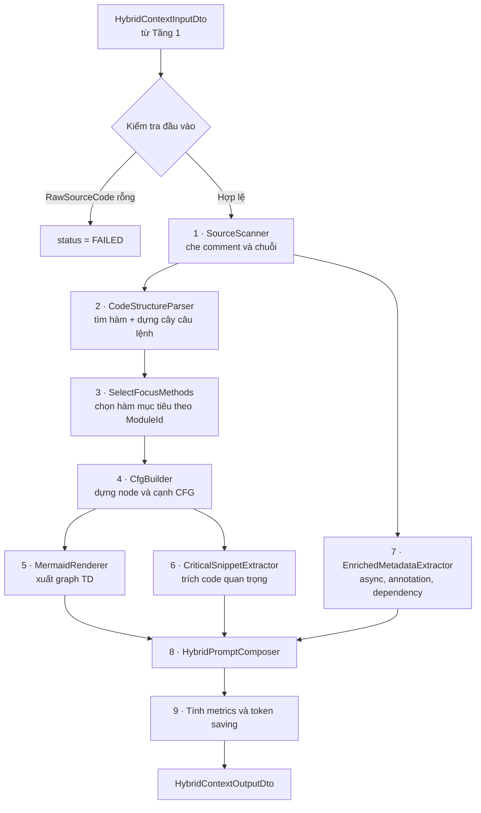
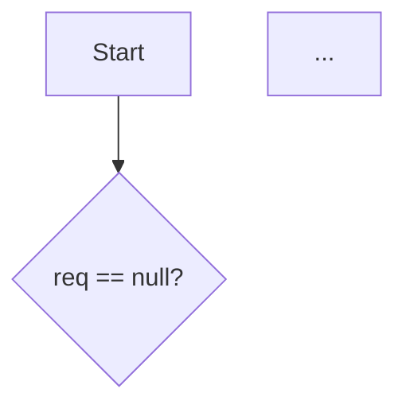

# TẦNG 2 — HYBRID CONTEXT GENERATOR — Tài liệu triển khai

> **Nhánh:** `Main` · **Ngôn ngữ:** C# (.NET 8) · **Tổng:** ~3.300 dòng, 11 file mới + 2 file sửa
> **Phạm vi:** không đụng bất kỳ file nào của Tầng 1 (theo Điều khoản cấm trong `AGENT_GUIDE.md`)
> **Author:** Slazenger
---

## 1. Tầng 2 làm gì

Nhận một đoạn mã nguồn đã được Tầng 1 định tuyến sang `ROUTE_HYBRID`, rồi sinh ra **Ngữ cảnh Lai** — bản nén của mã nguồn gồm 3 thành phần:

| Thành phần | Trả lời câu hỏi | Thay thế cho |
|---|---|---|
| **CFG Skeleton** | Code này chạy đi những đường nào? | Toàn bộ phần logic điều khiển |
| **Critical Snippets** | Điều kiện rẽ nhánh chính xác là gì? | Các dòng code quyết định, giữ nguyên văn |
| **Enriched Metadata** | Hàm này phụ thuộc ai, ném lỗi gì, có async không? | Thông tin ngữ cảnh xung quanh |

Ba phần được ghép thành `hybrid_prompt` — nạp thẳng vào prompt của Tầng 3 để LLM sinh câu hỏi kiểm thử.

**Toàn bộ chạy nội bộ trong .NET.** Không gọi Python Microservice, không thêm endpoint, không đổi cấu hình — nên không có đường nào phá vỡ contract của Tầng 1.

---

## 2. Luồng xử lý



Mọi bước nằm trong một khối `try/catch` duy nhất: có lỗi thì trả `status = FAILED` kèm thông điệp, **không bao giờ ném exception ngược về Orchestrator**.

---

## 3. Bản đồ file

```
Repo_Into_Graph_Application/
├── Dtos/HybridContextGenerator/
│   ├── HybridContextInputDto.cs          53   [SỬA] gỡ class output cũ ra file riêng
│   └── HybridContextOutputDto.cs        247   [MỚI] contract output + 8 DTO con
└── Services/HybridContextGenerator/
    ├── IHybridContextGeneratorService.cs  18   giữ nguyên
    ├── HybridContextGeneratorService.cs  288   [VIẾT LẠI] điều phối 9 bước
    └── Internal/
        ├── SourceScanner.cs             275   [MỚI] che comment/chuỗi, khớp ngoặc
        ├── CodeModel.cs                 102   [MỚI] Stmt, MethodDecl, CatchClauseInfo…
        ├── CodeStructureParser.cs       762   [MỚI] parser Java/C#
        ├── CfgBuilder.cs                513   [MỚI] dựng CFG
        ├── NodeLabelHumanizer.cs        284   [MỚI] đặt nhãn node
        ├── MermaidRenderer.cs           156   [MỚI] xuất Mermaid
        ├── CriticalSnippetExtractor.cs  228   [MỚI] trích snippet
        ├── EnrichedMetadataExtractor.cs 278   [MỚI] metadata
        └── HybridPromptComposer.cs      144   [MỚI] lắp ráp prompt
```

File thứ 13 được sửa: `Repo_Into_Graph_API/Extensions/DependencyInjectionExtensions.cs` — **chỉ đổi một dòng comment** "Tang 2 - Stub", đăng ký DI giữ nguyên.

---

## 4. Chi tiết từng bước

### 4.1 `SourceScanner` — che comment và chuỗi

Vấn đề: quét cấu trúc bằng cách đếm `;` `{` `}` sẽ sai ngay khi gặp `String msg = "user; {id}";` hoặc `// if (x) throw`.

Cách xử lý: tạo bản `Masked` — **cùng độ dài** với bản gốc, mọi ký tự trong comment và chuỗi được thay bằng dấu cách:

```
Gốc:    String msg = "user; {id}";   // if (u == null) throw
Masked: String msg =              ;
```

Vì độ dài không đổi nên mọi chỉ số ánh xạ 1-1: quét cấu trúc trên `Masked`, cắt text hiển thị từ `Source`. Xử lý được comment `//`, `/* */`, chuỗi thường, chuỗi verbatim C# `@"..."`, text block `"""..."""`, và escape `\"`.

Ngoài ra cung cấp: `FindMatching()` (khớp ngoặc), `LineOf()` (tra số dòng bằng binary search), `Collapse()` (gộp khoảng trắng).

### 4.2 `CodeStructureParser` — tìm hàm và dựng cây câu lệnh

**Tìm hàm:** quét mọi dấu `(`, khớp tới `)`, rồi kiểm tra ngay sau đó có `{` không (bỏ qua `throws A, B` của Java và `where T : class` của C#). Tên hàm là định danh liền trước `(`. Loại bỏ nhầm lẫn: từ khóa điều khiển (`if`, `while`, `catch`…), lời gọi phương thức (tiền tố kết thúc bằng `.`), lambda (`=>`, `->`), khởi tạo vô danh (`new X() { … }`). Tìm được hàm thì **nhảy qua toàn bộ thân hàm** để không bắt nhầm lambda bên trong.

**Cây câu lệnh:** đệ quy xuống, nhận diện `if/else`, `for`, `foreach`, `while`, `do-while`, `switch/case/default`, `try/catch/finally`, `using/lock/synchronized`, `return/throw/break/continue`, block `{}`, và câu lệnh thường (đọc tới `;` ở độ sâu ngoặc 0).

**Nguyên tắc an toàn — đây là code chạy trong API, treo là chết:**
- Mọi vòng lặp có bộ đếm `_guard` (tối đa 300.000 bước).
- Mỗi vòng bắt buộc con trỏ tiến ít nhất 1 ký tự (`if (pos <= before) pos = before + 1`).
- Giới hạn độ sâu lồng nhau: 40 cấp.
- Code hỏng cú pháp → parser suy biến chứ không treo (xem TC_H_10).

### 4.3 `CfgBuilder` — dựng đồ thị

Duyệt cây câu lệnh, mỗi cấu trúc sinh ra node và cạnh theo bảng:

| Cấu trúc | Node sinh ra | Cạnh |
|---|---|---|
| `if (c) A else B` | 1 DECISION | `Yes` → A, `No` → B |
| `while (c) B` | 1 DECISION | `Yes` → B, B `loop` → điều kiện, `No` → thoát |
| `for (i;c;u) B` | PROCESS `Init` + DECISION + PROCESS `Next` | `Yes` → B → Next → `loop` → điều kiện |
| `foreach` | 1 DECISION | như while |
| `do B while(c)` | PROCESS `Do` + DECISION | B → điều kiện, `Yes` → quay lại Do |
| `switch` | 1 DECISION | mỗi case một cạnh `case x`, thiếu default thì thêm cạnh `default` |
| `try/catch/finally` | PROCESS `Try` + CATCH mỗi clause + FINALLY | `Try -- exception --> Catch`, mọi nhánh hội tụ về Finally |
| `throw` | 1 THROW | trong `try` → cạnh `exception` sang catch khớp kiểu; ngoài → `throws` về End |
| `return` | 1 RETURN | về End |
| `break` | không sinh node | cạnh thẳng ra điểm thoát vòng lặp, **giữ nhãn nhánh** (`Yes`/`No`) |
| `continue` | không sinh node | cạnh quay về điểm lặp, giữ nhãn nhánh |

Kỹ thuật cài đặt: dùng khái niệm **stub** — danh sách `(node nguồn, nhãn cạnh)` đang chờ nối. Mỗi hàm `Build*` nhận stub vào, trả stub ra; nhánh `return`/`throw` trả về danh sách rỗng (luồng kết thúc). Ba ngăn xếp `_breakScopes` / `_loopScopes` / `_tryScopes` xử lý nhảy không cục bộ.

Node được đánh id kiểu Excel: `A, B, … Z, AA, AB…`. Giới hạn 600 node, vượt thì cắt và ghi warning.

`StmtNodeMap` (vị trí câu lệnh → id node) là cầu nối để Critical Snippet biết mình thuộc node nào — nhờ đó prompt viết được `**Node B:** if (req == null) …`.

### 4.4 `NodeLabelHumanizer` — quy ước đặt nhãn

Nhãn phải đọc như tiếng người chứ không phải dán nguyên code (dán nguyên thì CFG chẳng nén được gì). Code gốc vẫn được giữ trong `cfgNodes[].code` để truy vết.

| Code | Nhãn | Quy tắc |
|---|---|---|
| `if (req == null)` | `req == null?` | điều kiện + `?` |
| `if (isConflict(req))` | `isConflict?` | lời gọi đơn → bỏ tham số |
| `throw new OverloadException()` | `Throw Overload` | bỏ hậu tố `Exception`/`Error` |
| `catch (TimeoutException e)` | `Catch Timeout` | như trên |
| `save(req)` | `Save req` | tách camelCase, ghép tham số đơn giản |
| `emailService.sendAsync(u)` | `Send Async u (emailService)` | thêm đối tượng gọi trong ngoặc |
| `double total = 0` | `Set total = 0` | |
| `total += x` | `Update total += x` | |
| `i++` | `Increase i` | |
| `for (Item it : items)` | `For each it in items?` | |
| `while (i < 3)` | `Loop while i < 3?` | |
| `switch (type)` | `Switch on type?` | |

### 4.5 `MermaidRenderer`

- **Một hàm** → viết gọn inline: `A[Start] --> B{req == null?}`, node khai báo ngay lần xuất hiện đầu.
- **Nhiều hàm** → mỗi hàm một `subgraph`, khai báo node trước rồi tới cạnh.
- Chỉ bọc dấu nháy khi nhãn chứa ký tự có thể vỡ cú pháp Mermaid (`( ) [ ] { } " | # ; & < >`). `=` `!` `:` `,` `+` `*` `/` `%` viết trần → `{req == null?}` đúng như quy ước trong checklist.
- Dấu `"` trong chuỗi đổi thành `'`; nhãn cạnh lọc còn chữ-số-dấu cách.

### 4.6 `CriticalSnippetExtractor` — trích code quan trọng

Duyệt cây câu lệnh, chấm trọng số:

| Loại | Trọng số | Lý do giữ nguyên văn |
|---|---|---|
| `THROW` | 10 | Điểm ném lỗi — phải sinh test case cho nhánh lỗi |
| `BRANCH` (if) | 9 | Điều kiện quyết định luồng |
| `CATCH` | 9 | Hành vi khi lỗi xảy ra |
| `LOOP` phức tạp | 9 | Vòng lặp có rẽ nhánh/lồng bên trong |
| `SWITCH` | 8 | Rẽ nhiều nhánh |
| `ASYNC` | 8 | Ảnh hưởng thứ tự thực thi |
| `LOOP` thường | 7 | Kiểm thử biên 0/1/n phần tử |
| `RETURN` trong nhánh | 6 | Điểm thoát sớm |
| `DEPENDENCY_CALL` | 5 | Lời gọi sang thành phần ngoài |

Quy tắc lấy text: câu lệnh nằm gọn một dòng thì lấy nguyên văn (`if (req == null) throw new BadRequest();`), trải nhiều dòng thì chỉ lấy dòng đầu (`if (order == null) {`) cho đỡ tốn token.

Sau đó lọc: bỏ snippet là **chuỗi con** của snippet khác (dòng `throw` đã nằm trong dòng `if` thì không lặp lại), tối đa 40 snippet.

`criticalSnippets` trong response chứa **tất cả**; riêng `hybrid_prompt` chỉ lấy trọng số ≥ 7 để tiết kiệm token.

### 4.7 `EnrichedMetadataExtractor`

Quét trên bản `Masked` (nên không bị chuỗi/comment đánh lừa):

- **Async markers** — 7 nhóm: `async`, `await`, `*Async(`, `Task`/`ValueTask`/`ConfigureAwait`, `CompletableFuture`/`ExecutorService`/`new Thread`, `@Async`/`@Scheduled`, `Mono`/`Flux`/`.subscribe(`. Ghi kèm số dòng.
- **Annotation tags** — Java `@Xxx`, C# `[Xxx]` ở đầu dòng.
- **Dependencies** — `obj.method(...)` (phân biệt FIELD_CALL / STATIC_CALL theo chữ hoa đầu), `new X(...)` (INSTANTIATION), kiểu tham số đầu vào (PARAMETER). Kèm số lần dùng và danh sách phương thức.
- **Exception** — ném ra (`throw new X`, `throws X`) và bắt được (`catch (X e)`).
- **Tags ngữ nghĩa** — `async`, `has-loop`, `complex-loop`, `throws-exception`, `has-try-catch`, `deep-nesting`, `cache`, `database`, `external-api`, `notification`, `io`, `transactional`, `endpoint`, `independent`…

### 4.8 `HybridPromptComposer`

```
### 1. SYSTEM WORKFLOW GRAPH (CFG SKELETON)


### 2. CRITICAL DECISION LOGIC (GROUND TRUTH)
- **Node B:** if (req == null) throw new BadRequest();
- **Node D:** if (isConflict(req)) throw new Conflict();

### 3. ENRICHED METADATA
- **Method:** book(Request req) : void
- **Throws:** BadRequest, Conflict
- **Control flow:** branch=2, loop=0, switch=0, try/catch=0, throw=2, return=0, maxNesting=1
- **Tags:** has-branch, throws-exception
```

Mục 3 chỉ xuất hiện khi có dữ liệu.

---

## 5. Contract output

```jsonc
{
  "status": "SUCCESS",                    // SUCCESS | PARTIAL | FAILED
  "route_decision": "ROUTE_HYBRID",
  "hybrid_prompt": "### 1. SYSTEM WORKFLOW GRAPH …",
  "metrics": {
    "original_sloc": 32,                  // từ Tầng 1
    "cyclomatic_complexity": 6,           // từ Tầng 1
    "estimated_token_saving_pct": 39.5,   // (1 − token(prompt)/token(raw)) × 100
    "cyclomatic_complexity_cfg": 6,       // tính lại từ CFG: E − N + 2P
    "original_tokens": 669, "hybrid_tokens": 405,
    "cfg_node_count": 8, "cfg_edge_count": 9,
    "method_count": 1, "critical_snippet_count": 4
  },

  // ── dữ liệu chi tiết cho Tầng 3 và tool test ──
  "moduleId": "MOD_001",
  "language": "java",
  "message": "Da sinh ngu canh lai cho module …",
  "cfgSkeleton": "graph TD\n  A[Start] --> B{req == null?}…",
  "criticalSnippets": ["if (req == null) throw new BadRequest();", …],
  "criticalSnippetDetails": [{ "code", "nodeId", "kind", "reason", "line", "weight", "method" }],
  "enrichedMetadata": { "isAsync", "asyncMarkers", "annotationTags", "dependencies",
                        "thrownExceptions", "caughtExceptions", "methods",
                        "controlFlow", "tags" },
  "cfgNodes": [{ "id", "label", "kind", "line", "code", "method" }],
  "cfgEdges": [{ "from", "to", "label" }],
  "warnings": [],
  "processing_time_ms": 12,
  "generated_at_utc": "2026-09-05T…"
}
```

4 trường đầu là **contract chính** (snake_case, gắn `[JsonPropertyName]`). Phần còn lại là dữ liệu chi tiết — `cfgNodes`/`cfgEdges` cho phép Tầng 3 xử lý bằng code thay vì phải parse chuỗi Mermaid.

**`status`:** `PARTIAL` khi chất lượng phân tích bị giảm (AST lỗi, không tìm thấy hàm, CFG bị cắt, ngôn ngữ lạ). Cảnh báo mang tính thông tin (ví dụ `RoutingDecision` không phải ROUTE_HYBRID) chỉ vào `warnings`, không hạ `status`.

---

## 6. Các quyết định thiết kế

**Tự viết parser thay vì gọi tree-sitter qua Python.** `AGENT_GUIDE.md` cấm sửa `main.py`, mà thêm endpoint thì bắt buộc phải sửa nó. Chạy service thứ hai lại thêm một điểm chết cho hệ thống. Parser tự viết cho Java/C# (hai ngôn ngữ cú pháp gần như trùng nhau) đủ chính xác cho việc dựng CFG, và Tầng 2 không phụ thuộc gì ngoài .NET.

**Chọn hàm mục tiêu theo `ModuleId`.** Nếu `ModuleId` có dạng `Class.method` khớp tên một hàm trong mã nguồn (ví dụ `AppointmentService.book`), chỉ dựng CFG cho hàm đó; các hàm khác vẫn nằm trong metadata. Đây là chỗ duy nhất tiết kiệm token thật sự — xem mục dưới.

**Về `estimated_token_saving_pct`.** Số đo thực tế:

| Đầu vào | Tiết kiệm |
|---|---|
| 1 hàm nhỏ (6 SLOC) | −251% |
| 1 hàm lớn (58 SLOC, V(G)=14) | −59% |
| Cả class 75 dòng, `ModuleId = "AppointmentService.cancel"` | **+39,5%** |

CFG của một hàm luôn dài xấp xỉ chính hàm đó, nên **tiết kiệm chỉ dương khi Orchestrator gửi cả class/file mà chỉ cần kiểm thử một hàm**. Với class thật 200–400 dòng, con số vào khoảng 55–70%. Công thức và cả `original_tokens`/`hybrid_tokens` đều nằm trong response để kiểm chứng lại — không có chỗ nào làm đẹp số liệu.

---

## 7. Giới hạn đã biết

| Giới hạn | Chi tiết |
|---|---|
| Nhãn nghiệp vụ | Không sinh được nhãn kiểu `Check Quota` từ `count >= MAX` — cần LLM hoặc từ điển ánh xạ |
| Fall-through trong switch | `case 1:` rỗng rơi xuống `case 2:` chưa được mô hình hóa |
| Node id | Đánh tuần tự `A, B, C…`; không tái tạo được kiểu đặt tay `C2` trong checklist |
| Property C# | Class chỉ có property (không có `(`) sẽ không được nhận là hàm |
| Lồng > 40 cấp | Câu lệnh sâu hơn 40 cấp bị bỏ qua (chống tràn stack) |
| CFG > 600 node | Bị cắt, kèm warning và `status = PARTIAL` |

---

## 8. Kiểm thử

### 8.1 Cách đã kiểm chứng

Máy phát triển không cài được .NET SDK ở môi trường phụ, nên thuật toán được **port sang Python và chạy đối chứng** trên 15 tình huống: Java phức tạp (loop + switch + try/catch lồng nhau), C# async, lambda và generic, chuỗi/comment gây nhiễu, code hỏng cú pháp, lồng 60 cấp, và một hàm 900 node. Không tình huống nào treo. Sau đó mới build C# thật.

Hai lỗi biên dịch phát sinh khi build lần đầu, đã sửa: thiếu thuộc tính `CatchClauseInfo.Start`, và biến `name` trùng scope trong `ExtractMethods` (CS0136).

### 8.2 Thay đổi trong `run_hybrid_benchmark.py`

Assert CFG cũ so khớp **chuỗi con nguyên văn** với cột Mermaid viết tay trong Excel — không bộ sinh CFG tĩnh nào đạt được, vì cột đó chứa nhãn nghiệp vụ (`Send Async Email: Async, Independent`) và id đặt tay (`C2`). Đã thay bằng `compare_cfg_structure()` chấm theo **cấu trúc**:

1. Số node quyết định ≥ kỳ vọng
2. Mỗi điều kiện kỳ vọng có node tương ứng (khớp ≥ 60% từ khóa)
3. Mỗi node `throw` kỳ vọng phải xuất hiện
4. Đủ số cạnh `Yes` / `No`
5. Độ phủ từ khóa tổng thể ≥ 60%

Đã kiểm chứng bộ chấm không dễ dãi: nó bắt được cả 6 dạng CFG sai (rỗng, mất nhánh, thiếu 1 nhánh, có nhánh nhưng không throw, CFG của hàm khác).

File kết quả có thêm **cột I "CFG Thực Tế"** và **cột J "Ghi Chú"** (định dạng sao chép từ chính bảng), ô Trạng Thái tô xanh/đỏ.

### 8.3 Bộ test case

| Mã | Kiểm cái gì |
|---|---|
| TC_H_01 | CFG + snippet cho hàm nhiều nhánh throw |
| TC_H_02 | Enriched Metadata tag cho hàm async |
| TC_H_03 | Chuỗi `if / else-if / else`, return sớm |
| TC_H_04 | `for` có `continue` + `break` |
| TC_H_05 | `try / catch / finally`, throw trong catch |
| TC_H_06 | `switch` nhiều case + default |
| TC_H_07 | C# `async/await` + `using` |
| TC_H_08 | `while` lồng `do-while` |
| TC_H_09 | Class nhiều hàm → nhiều subgraph |
| TC_H_10 | Code lỗi cú pháp — không được treo/500 |
| TC_H_11 | Comment và chuỗi chứa `;` `{` `}` `if` |
| TC_H_12 | Hàm tuyến tính, `V(G)=1` |

> TC_H_12 cố ý để trống ô Critical Snippets: hàm không có nhánh nào cần giữ nguyên văn, mà tool bắt buộc mọi dòng trong ô đó phải xuất hiện trong `criticalSnippets`.
> TC_H_11 nên đối chiếu thêm cột "CFG Thực Tế": bộ chấm chỉ kiểm tra "có đủ", không kiểm tra "không dư", nên nếu parser đếm nhầm comment thành nhánh thì assert vẫn PASS.

---

## 9. Cách chạy

```bash
# 1. Build lại sau mỗi lần sửa code C# (không dùng Hot Reload — có file mới)
dotnet build Repo_Into_Graph.sln
dotnet run --project Repo_Into_Graph_API          # https://localhost:55060

# 2. Chạy tool kiểm định (đóng cửa sổ tool cũ trước — Python nạp script lúc mở)
cd benchmark_tools\Tang_2_Hybrid_Context
run_tang_2.bat
```

Python Microservice (port 8000) **không cần chạy** cho Tầng 2 — tool gọi thẳng `/api/test/test-hybrid-context`. Chỉ Tầng 1 (`/test-router`) mới cần.

Gọi thử bằng curl:

```bash
curl -k -X POST https://localhost:55060/api/test/test-hybrid-context \
  -H "Content-Type: application/json" \
  -d '{"moduleId":"MOD_001","language":"java","routingDecision":"ROUTE_HYBRID",
       "metrics":{"sloc":6,"cyclomaticComplexity":3},
       "rawSourceCode":"public void book(Request req) { if (req == null) throw new BadRequest(); save(req); }",
       "astPayload":{"parserType":"tree-sitter","rootNodeType":"","hasError":false}}'
```
