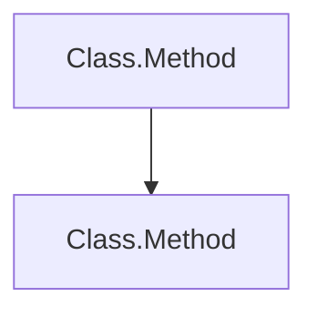

# Technical Specification - Static Code Analyzer

## Overview

This document provides detailed technical specifications for the Static Code Analyzer Phase 1 implementation.

---

## 1. System Architecture

### 1.1 Component Diagram

```
???????????????????????????????????????????????????????????????????
?                        CLI Entry Point                           ?
?                       (Program.cs)                               ?
???????????????????????????????????????????????????????????????????
                         ?
                         ?
         ?????????????????????????????????????????
         ?     CodeAnalyzer Orchestrator         ?
         ?  - File discovery & parsing           ?
         ?  - Semantic model creation            ?
         ?  - Result aggregation                 ?
         ?????????????????????????????????????????
                         ?
        ???????????????????????????????????
        ?                ?                ?
????????????????  ????????????????  ????????????????
? CallGraph    ?  ?  DataFlow    ?  ?  Mermaid     ?
? Extractor    ?  ?  Extractor   ?  ?  Generator   ?
?              ?  ?              ?  ?              ?
? - AST Walk   ?  ? - Variable   ?  ? - Diagram    ?
? - Filter Lib ?  ?   Tracking   ?  ?   Rendering  ?
? - Edge Build ?  ? - Flow Track ?  ?              ?
????????????????  ????????????????  ????????????????
        ?                ?                ?
        ???????????????????????????????????
                         ?
         ?????????????????????????????????????????
         ?         Output Writer                 ?
         ?  - JSON Serialization                 ?
         ?  - Markdown Generation                ?
         ?????????????????????????????????????????
```

---

## 2. Call Graph Extraction

### 2.1 Algorithm

```
FUNCTION ExtractCallGraph(filePath, syntaxTree, semanticModel)
    root ? GetCompilationUnitFromSyntaxTree(syntaxTree)
    visitor ? NEW CallGraphVisitor(semanticModel, filePath)

    WALK(root, visitor)
        ON VisitMethodDeclaration(methodNode)
            currentMethod ? methodNode.Identifier
            currentClass ? parentClassNode.Identifier

        ON VisitInvocationExpression(invocationNode)
            IF currentClass ? NULL AND currentMethod ? NULL
                symbolInfo ? semanticModel.GetSymbolInfo(invocationNode)
                methodSymbol ? symbolInfo.Symbol

                IF NOT IsStandardLibrary(methodSymbol)
                    calleeClass ? methodSymbol.ContainingType.Name
                    calleeName ? methodSymbol.Name

                    edge ? NEW CallGraphEdge
                    edge.CallerClass ? currentClass
                    edge.CallerMethod ? currentMethod
                    edge.CalleeClass ? calleeClass
                    edge.CalleeMethod ? calleeName
                    edge.FilePath ? filePath
                    edge.LineNumber ? invocationNode.GetLineNumber()

                    edges.Add(edge)

    RETURN edges
END FUNCTION
```

### 2.2 Namespace Filtering

Standard namespaces filtered:
- `System` (core types)
- `System.Collections`
- `System.Collections.Generic`
- `System.Linq` (query operators)
- `System.Text` (string builders, etc.)
- `System.IO` (file operations)
- `System.Threading` (async primitives)
- `System.Diagnostics` (logging)
- `System.Net` (network)
- `System.Reflection` (reflection APIs)

### 2.3 Edge Deduplication

Edges are deduplicated in Mermaid generation:
- Unique key: `CallerClass.CallerMethod ? CalleeClass.CalleeMethod`
- Multiple invocations of same method ? single edge
- Preserves line numbers in JSON (for detail)

---

## 3. Data Flow Graph Extraction

### 3.1 Data Flow Tracking Algorithm

```
FUNCTION ExtractDataFlow(filePath, syntaxTree, semanticModel)
    variables ? NEW Dictionary<string, DataFlowNode>
    root ? GetCompilationUnitFromSyntaxTree(syntaxTree)
    visitor ? NEW DataFlowVisitor(semanticModel, filePath, variables)

    WALK(root, visitor)
        ON VisitMethodDeclaration(methodNode)
            currentMethod ? methodNode.Identifier
            currentClass ? parentClassNode.Identifier

            // Track parameters as data sources
            FOR EACH parameter IN methodNode.Parameters
                paramName ? parameter.Identifier
                paramType ? parameter.Type

                IF NOT IsPrimitiveType(paramType)
                    node ? NEW DataFlowNode
                    node.VariableName ? paramName
                    node.DataType ? paramType.ToString()
                    node.SourceLocation ? currentClass + "." + currentMethod
                    variables[paramName] ? node

        ON VisitVariableDeclaration(varDeclNode)
            FOR EACH variable IN varDeclNode.Variables
                varName ? variable.Identifier
                varType ? varDeclNode.Type

                IF NOT IsPrimitiveType(varType)
                    node ? NEW DataFlowNode
                    node.VariableName ? varName
                    node.DataType ? varType.ToString()
                    node.SourceLocation ? filePath + ":" + lineNumber
                    variables[varName] ? node

        ON VisitInvocationExpression(invocationNode)
            FOR EACH argument IN invocationNode.Arguments
                argText ? argument.Expression.ToString()

                IF argText IN variables
                    methodSymbol ? GetMethodSymbol(invocationNode)
                    methodId ? methodSymbol.ContainingType + "." + methodSymbol.Name
                    variables[argText].PassedThroughMethods.Add(methodId)

        ON VisitReturnStatement(returnNode)
            returnExpr ? returnNode.Expression.ToString()

            IF returnExpr IN variables
                variables[returnExpr].SinkLocation ? currentClass + "." + currentMethod
                variables[returnExpr].SinkType ? "return"

    RETURN variables.Values
END FUNCTION
```

### 3.2 Primitive Type Filter

Excluded types (value semantics, not tracking):
- Numeric: `int`, `long`, `short`, `byte`, `float`, `double`, `decimal`
- Text: `string`, `char`
- Boolean: `bool`
- All `System.*` types

### 3.3 Data Nodes

Each node tracks:
- **VariableName**: Identifier in code
- **DataType**: Type annotation
- **SourceLocation**: Where variable originates
  - Parameter: `ClassName.MethodName`
  - Local: `FilePath:LineNumber`
- **PassedThroughMethods**: Methods receiving variable
- **SinkLocation**: Where variable terminates
- **SinkType**: How it terminates (`return`, `store`, etc.)

---

## 4. Roslyn Integration

### 4.1 Semantic Analysis

The tool uses Roslyn's semantic model for symbol resolution:

```csharp
// Create compilation with references
var compilation = CSharpCompilation.Create("TempAnalysis")
    .AddSyntaxTrees(syntaxTrees)
    .AddReferences(ReferenceAssemblies());

// Get semantic model for each tree
var semanticModel = compilation.GetSemanticModel(tree);

// Resolve symbols from invocation
var symbolInfo = semanticModel.GetSymbolInfo(invocationExpression);
var methodSymbol = symbolInfo.Symbol as IMethodSymbol;

// Access symbol information
var containingType = methodSymbol.ContainingType.Name;
var methodName = methodSymbol.Name;
var @namespace = methodSymbol.ContainingNamespace.ToDisplayString();
```

### 4.2 Syntax Walker Pattern

Both extractors inherit from `CSharpSyntaxWalker`:

```csharp
public class CustomVisitor : CSharpSyntaxWalker
{
    private string _currentClass;
    private string _currentMethod;

    public override void VisitClassDeclaration(ClassDeclarationSyntax node)
    {
        _currentClass = node.Identifier.Text;
        base.VisitClassDeclaration(node);  // Continue traversal
    }

    public override void VisitMethodDeclaration(MethodDeclarationSyntax node)
    {
        _currentMethod = node.Identifier.Text;
        base.VisitMethodDeclaration(node);  // Continue traversal
    }

    public override void VisitInvocationExpression(InvocationExpressionSyntax node)
    {
        // Process invocation with current context
        var symbolInfo = _semanticModel.GetSymbolInfo(node);
        // ...
        base.VisitInvocationExpression(node);  // Continue traversal
    }
}
```

---

## 5. Output Generation

### 5.1 JSON Schema

```json
{
  "$schema": "http://json-schema.org/draft-07/schema#",
  "title": "Code Analysis Result",
  "type": "object",
  "properties": {
    "CallGraph": {
      "type": "array",
      "items": {
        "type": "object",
        "properties": {
          "CallerClass": { "type": "string" },
          "CallerMethod": { "type": "string" },
          "CalleeClass": { "type": "string" },
          "CalleeMethod": { "type": "string" },
          "FilePath": { "type": "string" },
          "LineNumber": { "type": "integer" }
        },
        "required": ["CallerClass", "CallerMethod", "CalleeClass", "CalleeMethod"]
      }
    },
    "DataFlowGraph": {
      "type": "array",
      "items": {
        "type": "object",
        "properties": {
          "VariableName": { "type": "string" },
          "DataType": { "type": "string" },
          "SourceLocation": { "type": ["string", "null"] },
          "PassedThroughMethods": { 
            "type": "array",
            "items": { "type": "string" }
          },
          "SinkLocation": { "type": ["string", "null"] },
          "SinkType": { "type": ["string", "null"] }
        },
        "required": ["VariableName", "DataType", "PassedThroughMethods"]
      }
    },
    "MermaidCallGraph": { "type": "string" },
    "MermaidDataFlowGraph": { "type": "string" }
  }
}
```

### 5.2 Mermaid Diagram Generation

#### Call Graph Format


Node naming rules:
- Replace dots with underscores: `UserService.GetById` ? `UserService_GetById`
- Remove special characters: `(`, `)`, `,`, `/`

#### Data Flow Graph Format
```mermaid
graph LR
    source["?? Source: Location"]
    var["VariableName"]
    method["Methods: Method1, Method2"]
    sink["?? Sink: Location"]

    source -->|VariableName (Type)| var
    var -->|Passed Through| method
    var -->|return| sink
```

---

## 6. Complexity Analysis

### Time Complexity
- **File Parsing**: O(n) where n = total lines of code
- **AST Traversal**: O(n) - single pass through AST
- **Semantic Analysis**: O(m) where m = number of symbols
- **Overall**: O(n + m)

### Space Complexity
- **Syntax Trees**: O(n) - proportional to source code size
- **Call Graph Edges**: O(e) where e = number of method calls
- **Data Flow Nodes**: O(v) where v = number of variables
- **Overall**: O(n + e + v)

---

## 7. Error Handling

### Recoverable Errors

```csharp
try
{
    var code = await File.ReadAllTextAsync(file);
    var tree = CSharpSyntaxTree.ParseText(code);
    syntaxTrees.Add(tree);
}
catch (Exception ex)
{
    Console.WriteLine($"? Error parsing {file}: {ex.Message}");
    // Continue with other files
}
```

### Semantic Analysis

If semantic model creation fails:
- Continue with syntax-only analysis
- Report warning to user
- Process remaining files

---

## 8. Extensibility Points

### Custom Filters

Extend `ICallFilter` interface:
```csharp
public interface ICallFilter
{
    bool ShouldInclude(IMethodSymbol methodSymbol);
}
```

### Custom Data Flow Trackers

Extend `DataFlowVisitor`:
```csharp
public class CustomDataFlowVisitor : DataFlowVisitor
{
    public override void VisitCustomNode(CustomNodeSyntax node)
    {
        // Custom tracking logic
        base.VisitCustomNode(node);
    }
}
```

### Output Formats

Implement `IOutputWriter`:
```csharp
public interface IOutputWriter
{
    Task WriteAsync(string path, AnalysisResult result);
}
```

---

## 9. Testing Strategy

### Unit Tests
- **CallGraphExtractor**: Validate edge extraction
- **DataFlowGraphExtractor**: Validate flow tracking
- **MermaidGenerator**: Validate diagram syntax

### Integration Tests
- End-to-end analysis on sample projects
- Verify JSON output structure
- Validate Mermaid diagram rendering

### Performance Tests
- Analyze large codebases (10k+ LOC)
- Memory profiling
- Parse time metrics

---

## 10. Known Limitations

1. **No Interface Resolution**: Calls through interfaces may be missed
2. **Dynamic Invocations**: Reflection-based calls not tracked
3. **LINQ Queries**: Complex LINQ chains not fully analyzed
4. **Task/Async**: Task chains partially tracked
5. **Generic Type Parameters**: Type resolution limited
6. **Null Propagation**: Flow through null coalescing not tracked
7. **Cross-Assembly**: Doesn't analyze external assemblies

---

## 11. Future Optimizations

1. **Incremental Analysis**: Cache previous results
2. **Parallel Processing**: Process files in parallel
3. **Lazy Evaluation**: Generate graphs on-demand
4. **Symbol Caching**: Cache semantic model results
5. **Graph Compression**: Merge redundant nodes

---

**Document Version**: 1.0  
**Last Updated**: 2024  
**Status**: Complete
