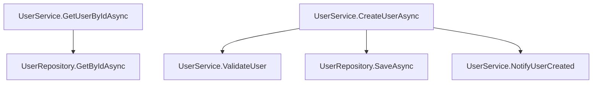

# Call Graph

```mermaid
graph TD
    UserService_GetUserByIdAsync["UserService.GetUserByIdAsync"] --> UserRepository_GetByIdAsync["UserRepository.GetByIdAsync"]
    UserService_CreateUserAsync["UserService.CreateUserAsync"] --> UserService_ValidateUser["UserService.ValidateUser"]
    UserService_CreateUserAsync["UserService.CreateUserAsync"] --> UserRepository_SaveAsync["UserRepository.SaveAsync"]
    UserService_CreateUserAsync["UserService.CreateUserAsync"] --> UserService_NotifyUserCreated["UserService.NotifyUserCreated"]

```