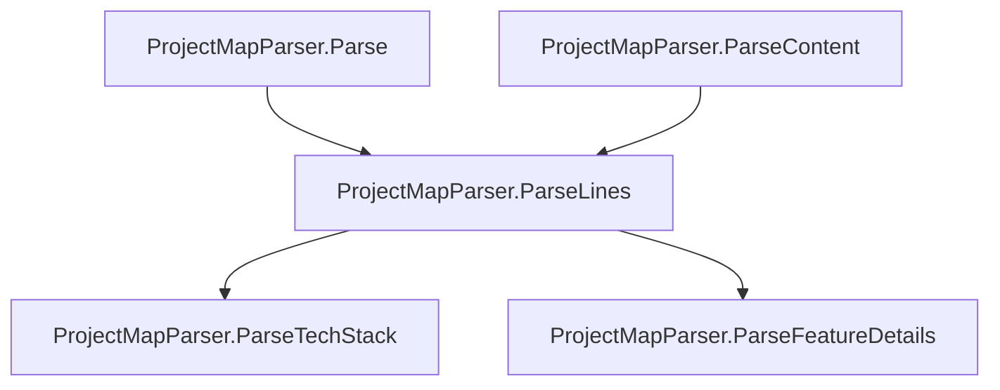

# Call Graph

```mermaid
graph TD
    ProjectMapParser_Parse["ProjectMapParser.Parse"] --> ProjectMapParser_ParseLines["ProjectMapParser.ParseLines"]
    ProjectMapParser_ParseContent["ProjectMapParser.ParseContent"] --> ProjectMapParser_ParseLines["ProjectMapParser.ParseLines"]
    ProjectMapParser_ParseLines["ProjectMapParser.ParseLines"] --> ProjectMapParser_ParseTechStack["ProjectMapParser.ParseTechStack"]
    ProjectMapParser_ParseLines["ProjectMapParser.ParseLines"] --> ProjectMapParser_ParseFeatureDetails["ProjectMapParser.ParseFeatureDetails"]

```