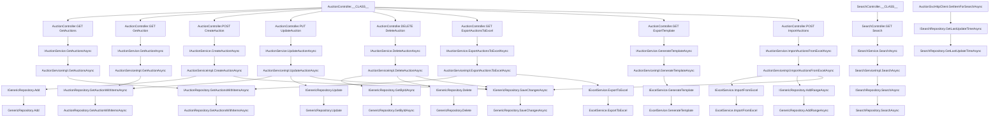

# Call Graph

```mermaid
graph TD
    AuctionController___CLASS__["AuctionController.__CLASS__"] --> AuctionController_GET_GetAuctions["AuctionController.GET GetAuctions"]
    AuctionController_GET_GetAuctions["AuctionController.GET GetAuctions"] --> IAuctionService_GetAuctionsAsync["IAuctionService.GetAuctionsAsync"]
    IAuctionService_GetAuctionsAsync["IAuctionService.GetAuctionsAsync"] --> AuctionServiceimpl_GetAuctionsAsync["AuctionServiceimpl.GetAuctionsAsync"]
    AuctionController___CLASS__["AuctionController.__CLASS__"] --> AuctionController_GET_GetAuction["AuctionController.GET GetAuction"]
    AuctionController_GET_GetAuction["AuctionController.GET GetAuction"] --> IAuctionService_GetAuctionAsync["IAuctionService.GetAuctionAsync"]
    IAuctionService_GetAuctionAsync["IAuctionService.GetAuctionAsync"] --> AuctionServiceimpl_GetAuctionAsync["AuctionServiceimpl.GetAuctionAsync"]
    AuctionController___CLASS__["AuctionController.__CLASS__"] --> AuctionController_POST_CreateAuction["AuctionController.POST CreateAuction"]
    AuctionController_POST_CreateAuction["AuctionController.POST CreateAuction"] --> IAuctionService_CreateAuctionAsync["IAuctionService.CreateAuctionAsync"]
    IAuctionService_CreateAuctionAsync["IAuctionService.CreateAuctionAsync"] --> AuctionServiceimpl_CreateAuctionAsync["AuctionServiceimpl.CreateAuctionAsync"]
    AuctionController___CLASS__["AuctionController.__CLASS__"] --> AuctionController_PUT_UpdateAuction["AuctionController.PUT UpdateAuction"]
    AuctionController_PUT_UpdateAuction["AuctionController.PUT UpdateAuction"] --> IAuctionService_UpdateAuctionAsync["IAuctionService.UpdateAuctionAsync"]
    IAuctionService_UpdateAuctionAsync["IAuctionService.UpdateAuctionAsync"] --> AuctionServiceimpl_UpdateAuctionAsync["AuctionServiceimpl.UpdateAuctionAsync"]
    AuctionController___CLASS__["AuctionController.__CLASS__"] --> AuctionController_DELETE_DeleteAuction["AuctionController.DELETE DeleteAuction"]
    AuctionController_DELETE_DeleteAuction["AuctionController.DELETE DeleteAuction"] --> IAuctionService_DeleteAuctionAsync["IAuctionService.DeleteAuctionAsync"]
    IAuctionService_DeleteAuctionAsync["IAuctionService.DeleteAuctionAsync"] --> AuctionServiceimpl_DeleteAuctionAsync["AuctionServiceimpl.DeleteAuctionAsync"]
    AuctionController___CLASS__["AuctionController.__CLASS__"] --> AuctionController_GET_ExportAuctionsToExcel["AuctionController.GET ExportAuctionsToExcel"]
    AuctionController_GET_ExportAuctionsToExcel["AuctionController.GET ExportAuctionsToExcel"] --> IAuctionService_ExportAuctionsToExcelAsync["IAuctionService.ExportAuctionsToExcelAsync"]
    IAuctionService_ExportAuctionsToExcelAsync["IAuctionService.ExportAuctionsToExcelAsync"] --> AuctionServiceimpl_ExportAuctionsToExcelAsync["AuctionServiceimpl.ExportAuctionsToExcelAsync"]
    AuctionController___CLASS__["AuctionController.__CLASS__"] --> AuctionController_GET_ExportTemplate["AuctionController.GET ExportTemplate"]
    AuctionController_GET_ExportTemplate["AuctionController.GET ExportTemplate"] --> IAuctionService_GenerateTemplateAsync["IAuctionService.GenerateTemplateAsync"]
    IAuctionService_GenerateTemplateAsync["IAuctionService.GenerateTemplateAsync"] --> AuctionServiceimpl_GenerateTemplateAsync["AuctionServiceimpl.GenerateTemplateAsync"]
    AuctionController___CLASS__["AuctionController.__CLASS__"] --> AuctionController_POST_ImportAuctions["AuctionController.POST ImportAuctions"]
    AuctionController_POST_ImportAuctions["AuctionController.POST ImportAuctions"] --> IAuctionService_ImportAuctionsFromExcelAsync["IAuctionService.ImportAuctionsFromExcelAsync"]
    IAuctionService_ImportAuctionsFromExcelAsync["IAuctionService.ImportAuctionsFromExcelAsync"] --> AuctionServiceimpl_ImportAuctionsFromExcelAsync["AuctionServiceimpl.ImportAuctionsFromExcelAsync"]
    SearchController___CLASS__["SearchController.__CLASS__"] --> SearchController_GET_Search["SearchController.GET Search"]
    SearchController_GET_Search["SearchController.GET Search"] --> ISearchService_SearchAsync["ISearchService.SearchAsync"]
    ISearchService_SearchAsync["ISearchService.SearchAsync"] --> SearchServiceImpl_SearchAsync["SearchServiceImpl.SearchAsync"]
    AuctionServiceimpl_CreateAuctionAsync["AuctionServiceimpl.CreateAuctionAsync"] --> IGenericRepository_Add["IGenericRepository.Add"]
    IGenericRepository_Add["IGenericRepository.Add"] --> GenericRepository_Add["GenericRepository.Add"]
    AuctionServiceimpl_CreateAuctionAsync["AuctionServiceimpl.CreateAuctionAsync"] --> IGenericRepository_SaveChangesAsync["IGenericRepository.SaveChangesAsync"]
    IGenericRepository_SaveChangesAsync["IGenericRepository.SaveChangesAsync"] --> GenericRepository_SaveChangesAsync["GenericRepository.SaveChangesAsync"]
    AuctionServiceimpl_DeleteAuctionAsync["AuctionServiceimpl.DeleteAuctionAsync"] --> IGenericRepository_GetByIdAsync["IGenericRepository.GetByIdAsync"]
    IGenericRepository_GetByIdAsync["IGenericRepository.GetByIdAsync"] --> GenericRepository_GetByIdAsync["GenericRepository.GetByIdAsync"]
    AuctionServiceimpl_DeleteAuctionAsync["AuctionServiceimpl.DeleteAuctionAsync"] --> IGenericRepository_Delete["IGenericRepository.Delete"]
    IGenericRepository_Delete["IGenericRepository.Delete"] --> GenericRepository_Delete["GenericRepository.Delete"]
    AuctionServiceimpl_DeleteAuctionAsync["AuctionServiceimpl.DeleteAuctionAsync"] --> IGenericRepository_SaveChangesAsync["IGenericRepository.SaveChangesAsync"]
    AuctionServiceimpl_ExportAuctionsToExcelAsync["AuctionServiceimpl.ExportAuctionsToExcelAsync"] --> IAuctionRepository_GetAuctionsWithItemsAsync["IAuctionRepository.GetAuctionsWithItemsAsync"]
    IAuctionRepository_GetAuctionsWithItemsAsync["IAuctionRepository.GetAuctionsWithItemsAsync"] --> AuctionRepository_GetAuctionsWithItemsAsync["AuctionRepository.GetAuctionsWithItemsAsync"]
    AuctionServiceimpl_ExportAuctionsToExcelAsync["AuctionServiceimpl.ExportAuctionsToExcelAsync"] --> IExcelService_ExportToExcel["IExcelService.ExportToExcel"]
    IExcelService_ExportToExcel["IExcelService.ExportToExcel"] --> ExcelService_ExportToExcel["ExcelService.ExportToExcel"]
    AuctionServiceimpl_GenerateTemplateAsync["AuctionServiceimpl.GenerateTemplateAsync"] --> IExcelService_GenerateTemplate["IExcelService.GenerateTemplate"]
    IExcelService_GenerateTemplate["IExcelService.GenerateTemplate"] --> ExcelService_GenerateTemplate["ExcelService.GenerateTemplate"]
    AuctionServiceimpl_GetAuctionAsync["AuctionServiceimpl.GetAuctionAsync"] --> IAuctionRepository_GetAuctionWithItemsAsync["IAuctionRepository.GetAuctionWithItemsAsync"]
    IAuctionRepository_GetAuctionWithItemsAsync["IAuctionRepository.GetAuctionWithItemsAsync"] --> AuctionRepository_GetAuctionWithItemsAsync["AuctionRepository.GetAuctionWithItemsAsync"]
    AuctionServiceimpl_GetAuctionsAsync["AuctionServiceimpl.GetAuctionsAsync"] --> IAuctionRepository_GetAuctionsWithItemsAsync["IAuctionRepository.GetAuctionsWithItemsAsync"]
    AuctionServiceimpl_ImportAuctionsFromExcelAsync["AuctionServiceimpl.ImportAuctionsFromExcelAsync"] --> IExcelService_ImportFromExcel["IExcelService.ImportFromExcel"]
    IExcelService_ImportFromExcel["IExcelService.ImportFromExcel"] --> ExcelService_ImportFromExcel["ExcelService.ImportFromExcel"]
    AuctionServiceimpl_ImportAuctionsFromExcelAsync["AuctionServiceimpl.ImportAuctionsFromExcelAsync"] --> IGenericRepository_AddRangeAsync["IGenericRepository.AddRangeAsync"]
    IGenericRepository_AddRangeAsync["IGenericRepository.AddRangeAsync"] --> GenericRepository_AddRangeAsync["GenericRepository.AddRangeAsync"]
    AuctionServiceimpl_ImportAuctionsFromExcelAsync["AuctionServiceimpl.ImportAuctionsFromExcelAsync"] --> IGenericRepository_SaveChangesAsync["IGenericRepository.SaveChangesAsync"]
    AuctionServiceimpl_UpdateAuctionAsync["AuctionServiceimpl.UpdateAuctionAsync"] --> IAuctionRepository_GetAuctionWithItemsAsync["IAuctionRepository.GetAuctionWithItemsAsync"]
    AuctionServiceimpl_UpdateAuctionAsync["AuctionServiceimpl.UpdateAuctionAsync"] --> IGenericRepository_Update["IGenericRepository.Update"]
    IGenericRepository_Update["IGenericRepository.Update"] --> GenericRepository_Update["GenericRepository.Update"]
    AuctionServiceimpl_UpdateAuctionAsync["AuctionServiceimpl.UpdateAuctionAsync"] --> IGenericRepository_SaveChangesAsync["IGenericRepository.SaveChangesAsync"]
    AuctionSvcHttpClient_GetItemForSearchAsync["AuctionSvcHttpClient.GetItemForSearchAsync"] --> ISearchRepository_GetLastUpdateTimeAsync["ISearchRepository.GetLastUpdateTimeAsync"]
    ISearchRepository_GetLastUpdateTimeAsync["ISearchRepository.GetLastUpdateTimeAsync"] --> SearchRepository_GetLastUpdateTimeAsync["SearchRepository.GetLastUpdateTimeAsync"]
    SearchServiceImpl_SearchAsync["SearchServiceImpl.SearchAsync"] --> ISearchRepository_SearchAsync["ISearchRepository.SearchAsync"]
    ISearchRepository_SearchAsync["ISearchRepository.SearchAsync"] --> SearchRepository_SearchAsync["SearchRepository.SearchAsync"]

```